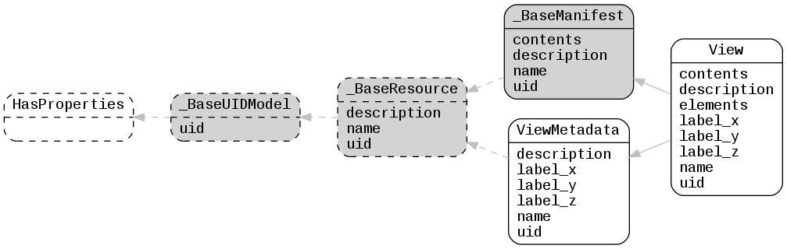

.. _lfview_resources_manifests_manifests:

Manifests Resources
************************************************************************
Manifest resources that hold a list of other resources

Doc links:
:class:`_BaseManifest <lfview.resources.manifests.manifests._BaseManifest>`
:class:`_BaseResource <lfview.resources.spatial.base._BaseResource>`
:class:`_BaseUIDModel <lfview.resources.files.base._BaseUIDModel>`
:class:`HasProperties <properties.HasProperties>`
:class:`View <lfview.resources.manifests.manifests.View>`
:class:`ViewMetadata <lfview.resources.manifests.manifests.ViewMetadata>`

.. autoclass:: lfview.resources.manifests.manifests._BaseManifest

.. autoclass:: lfview.resources.manifests.manifests.View

.. autoclass:: lfview.resources.manifests.manifests.ViewMetadata

